# 🏥 AyurCard – The Future of Healthcare & Intelligent Medical System

An **AI-powered Healthcare Management System** designed to centralize patient medical records, streamline doctor-patient interactions, and assist healthcare professionals through **Machine Learning-based acute and chronic disease prediction**.

---

## 📌 Project Overview

**AyurCard** is an intelligent healthcare platform that provides secure and centralized access to patient medical records through a unique **AyurCard ID**.

The platform connects **Patients, Doctors, Medical Stores, and Administrators** while integrating Machine Learning for intelligent disease prediction and healthcare assistance.

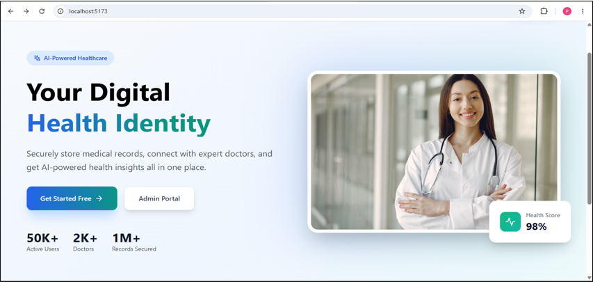

---

## ✨ Key Features

### 👨‍⚕️ Doctor Registration

Doctors can register using their Aadhaar number, contact details, specialization, medical license number, and password.

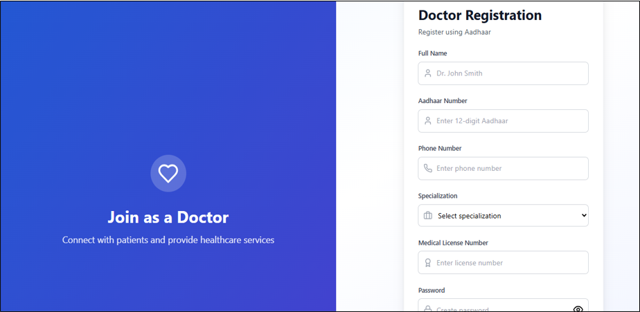

---

### 👤 Patient Registration

Patients can create their AyurCard account using their personal details, Aadhaar number, phone number, and password.

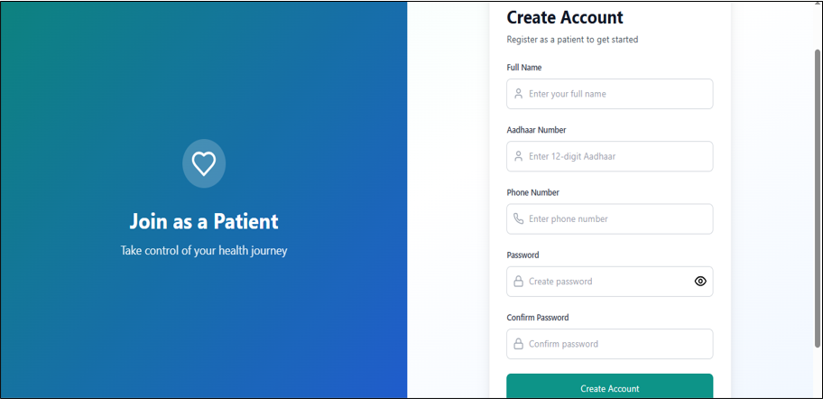

---

### 🔐 Secure Login

Registered users can securely access the system using their Aadhaar number and password with **role-based authentication**.

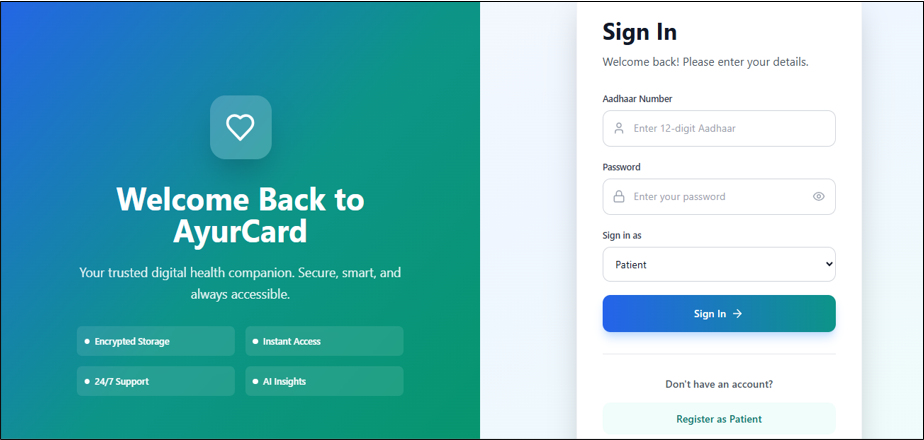

---

## 👤 Patient Module

Patients can:

- View Complete Medical History
- Book Doctor Appointments
- View Previous Diagnoses & Prescriptions
- Access AI Health Insights
- Raise Complaints

### 🤖 AI Health Insights

The AI Health Insight System analyzes patient symptoms and medical records to provide intelligent disease predictions.

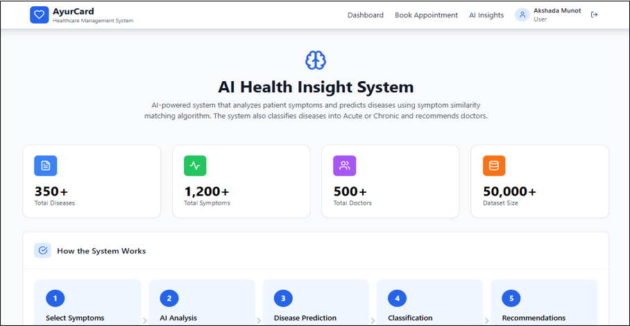

### 📅 Doctor Appointment Booking

Patients can search for doctors and book appointments according to their healthcare requirements.

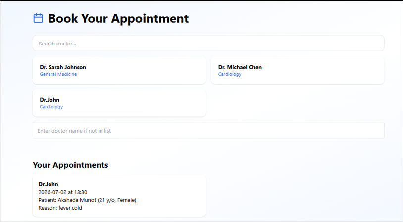

### 📋 Patient Medical History

Medical records are centrally maintained using the patient's unique **AyurCard ID**.

The system stores:

- Previous Symptoms
- Diagnosed Diseases
- Treatments
- Consulting Doctors
- Consultation Fees
- Treatment Status

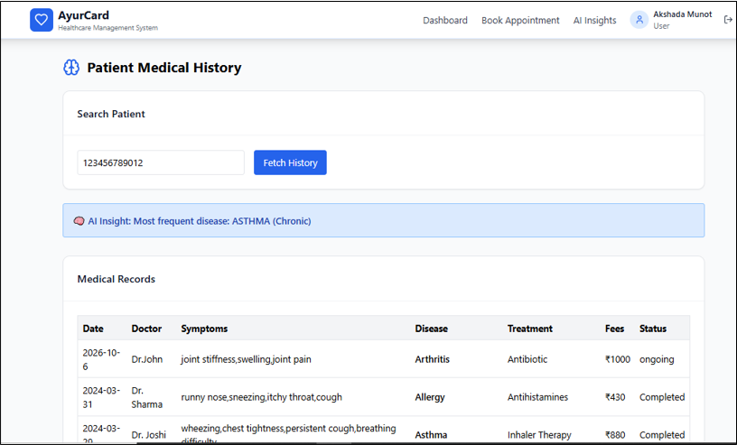

---

## 👨‍⚕️ Doctor Module

Doctors can:

- View Patient Appointment Requests
- Access Patient Medical History using AyurCard ID
- Enter Symptoms & Diagnosis Details
- Generate AI-assisted Disease Predictions
- Add Treatment & Consultation Details
- Maintain Patient Medical Records

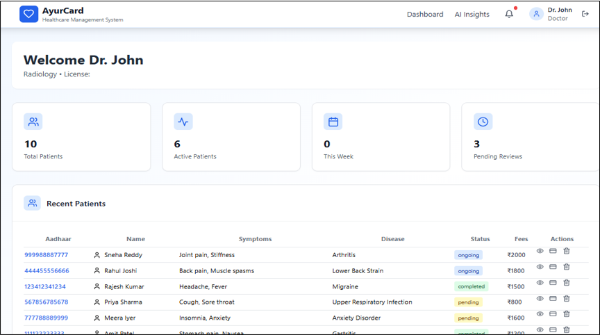

### 🧠 AI-Based Disease Prediction

Doctors enter patient symptoms into the system. The Machine Learning system analyzes the symptoms and medical history to predict possible diseases along with their prediction probability.

The doctor can then add treatment details and save the consultation record to the patient's medical history.

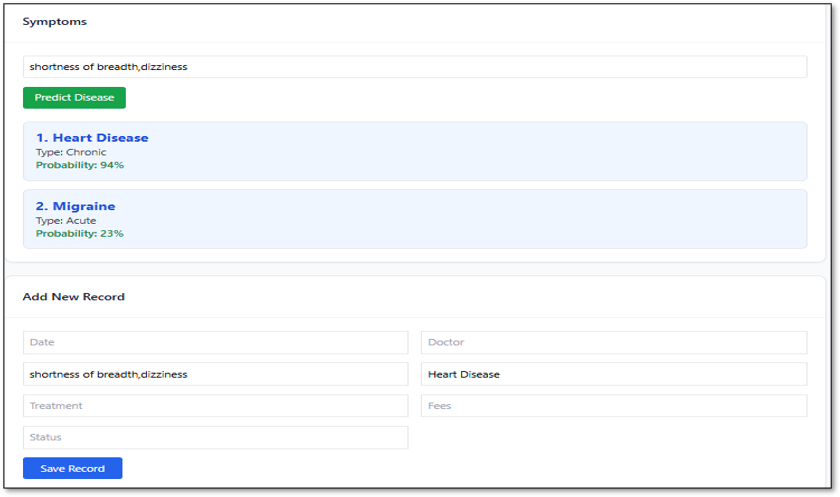

---

## 💊 Medical Store Module

Medical stores can:

- Access Patient Prescriptions using AyurCard ID
- Enter Medicine Prices
- Record Recommended Medicine Intake Timings
- Maintain Prescription Information
- Help patients track medicine dosage and intake timings

The medicine intake tracking feature is especially useful for **elderly patients who may forget to take medicines on time**.

---

## 🛡️ Admin Module

Administrators can:

- Manage Patients & Doctors
- Monitor Patient Complaints
- Handle Complaint Resolution
- Manage Healthcare Services
- Maintain accountability within the healthcare system

### ⚠️ Complaint Management

Patients can raise complaints regarding doctors or healthcare services. The administrator reviews the complaint, communicates with the concerned party, and updates the resolution status.

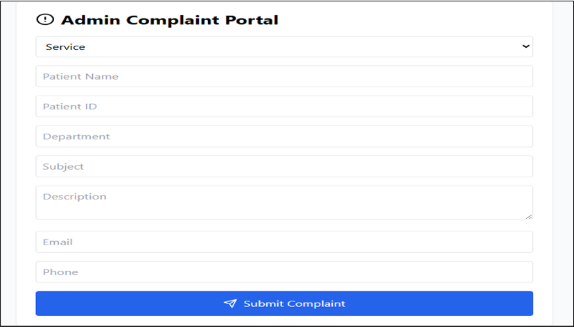

---

## 🤖 Machine Learning Implementation

AyurCard uses Machine Learning to analyze patient symptoms and medical history for disease prediction.

### 🔹 Acute Disease Prediction

The system analyzes the patient's **recent diagnosis records** to predict possible short-term diseases.

### 🔹 Chronic Disease Prediction

The system analyzes the patient's **complete medical history** to predict possible long-term diseases.

### 🌳 Random Forest

Random Forest combines multiple decision trees to provide stable disease predictions and reduce overfitting.

### 🚀 XGBoost

XGBoost sequentially builds decision trees where each new tree improves errors from previous predictions.

### ML Libraries

- Scikit-learn
- Pandas
- NumPy

---

## 🛠️ Technology Stack

### 💻 Frontend
- React.js
- HTML
- CSS
- JavaScript

### ⚙️ Backend
- Python
- Flask
- Node.js
- Express.js
- REST APIs

### 🗄️ Database
- MongoDB

### 🤖 Machine Learning
- Python
- Scikit-learn
- Pandas
- NumPy
- Random Forest
- XGBoost

### 🔐 Security
- JWT Authentication
- Role-Based Access

### 🧰 Tools
- VS Code
- Git
- GitHub
- Postman

---

## 🔄 System Workflow

1. Patient and Doctor register on the AyurCard platform.
2. Users securely log in to the system.
3. Medical records are linked with the patient's **AyurCard ID**.
4. Patient books an appointment with a doctor.
5. Doctor accesses the patient's medical history using AyurCard ID.
6. Doctor enters symptoms and diagnosis details.
7. AI analyzes symptoms and patient medical history.
8. Machine Learning models predict possible **acute and chronic diseases**.
9. Doctor adds diagnosis, treatment, prescription, fees, and consultation status.
10. Patient medical history is updated.
11. Medical stores maintain medicine price and intake information.
12. Patients can raise complaints regarding healthcare services.
13. Admin reviews and manages complaints.

---

## 🏆 Project Recognition & Achievements

### 📜 Government of India Copyright

**AyurCard – AI-Powered Personalized Healthcare System** has received **Copyright Registration from the Copyright Office, Government of India**, recognizing the original work and intellectual property associated with the project.

```md

```

---

### 🎓 International Conference – AITC 2026

Research based on **AyurCard** was presented at the **Fourth International Conference on Advances in Information, Telecommunication and Computing (AITC-2026)**.

### 📄 Research Paper

**“AyurCard: An AI-Driven Unified Healthcare Ecosystem for Centralized Medical Record Management and Intelligent Disease Prediction”**

**Conference:** Fourth International Conference on Advances in Information, Telecommunication and Computing (AITC-2026)

**Date:** June 27–28, 2026

The research work was **presented and approved for publication** at the conference.

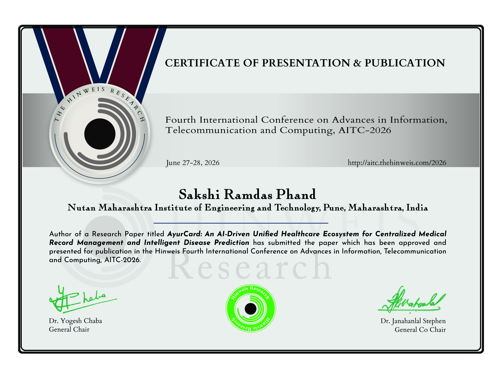

---

## 🚀 Future Enhancements

- IoT-based Health Monitoring
- Online Video Consultation
- Improved AI Prediction Models
- AI-based Doctor Recommendation
- Medicine Recommendation System
- Emergency SOS Services
- Cloud Deployment
- Mobile Application

---

## 🎯 Project Objective

AyurCard aims to create a **centralized, secure, and intelligent healthcare ecosystem** that:

- Maintains patient medical records in one place
- Improves doctor-patient interaction
- Provides AI-assisted disease prediction
- Helps reduce repeated medical tests and misdiagnosis
- Improves transparency in healthcare services
- Supports better healthcare decision-making

---

## 👩‍💻 Developed By

**Sakshi Ramdas Phand**  
Bachelor of Engineering – Computer Engineering

---
